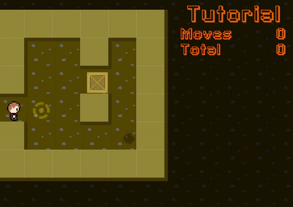

```
                       ███╗   ███╗ ██████╗ ██╗   ██╗███████╗
                       ████╗ ████║██╔═══██╗██║   ██║██╔════╝
                       ██╔████╔██║██║   ██║██║   ██║█████╗
                       ██║╚██╔╝██║██║   ██║╚██╗ ██╔╝██╔══╝
                       ██║ ╚═╝ ██║╚██████╔╝ ╚████╔╝ ███████╗
                       ╚═╝     ╚═╝ ╚═════╝   ╚═══╝  ╚══════╝

                       ████████╗██╗  ██╗███████╗
                       ╚══██╔══╝██║  ██║██╔════╝
                          ██║   ███████║█████╗
                          ██║   ██╔══██║██╔══╝
                          ██║   ██║  ██║███████╗
                          ╚═╝   ╚═╝  ╚═╝╚══════╝

                       ██████╗  ██████╗ ██╗  ██╗███████╗███████╗
                       ██╔══██╗██╔═══██╗╚██╗██╔╝██╔════╝██╔════╝
                       ██████╔╝██║   ██║ ╚███╔╝ █████╗  ███████╗
                       ██╔══██╗██║   ██║ ██╔██╗ ██╔══╝  ╚════██║
                       ██████╔╝╚██████╔╝██╔╝ ██╗███████╗███████║
                       ╚═════╝  ╚═════╝ ╚═╝  ╚═╝╚══════╝╚══════╝
```

Sokoban like game implemented in [Ember](http://emberjs.com).

## Screenshot



## License

move-the-boxes is licensed under the MIT license.

Sokoban is a registered and protected trademark by [FALCON CO.,LTD](www.sokoban.jp).

See [LICENSE](./LICENSE) for the full license text.
